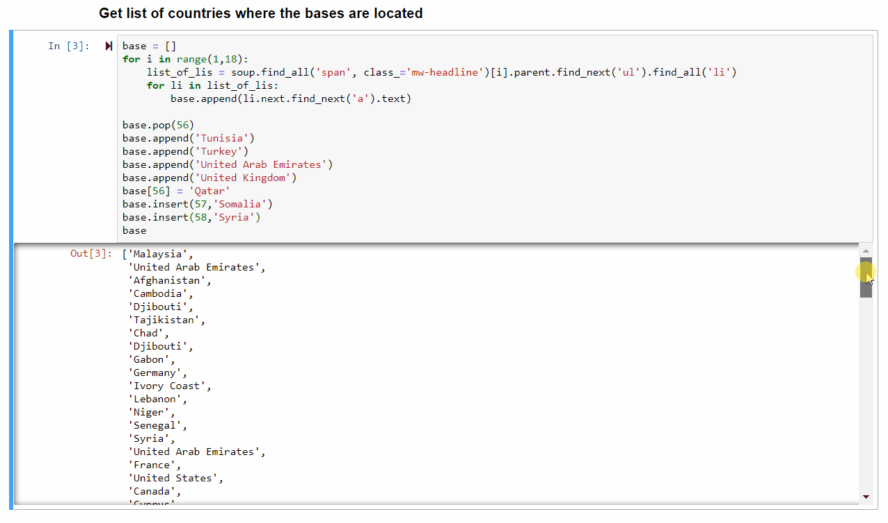
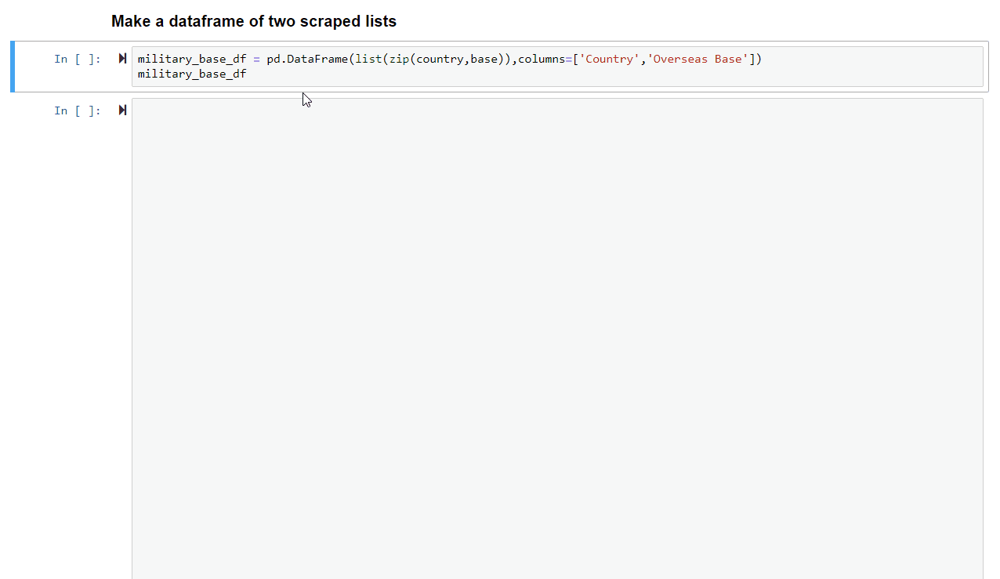
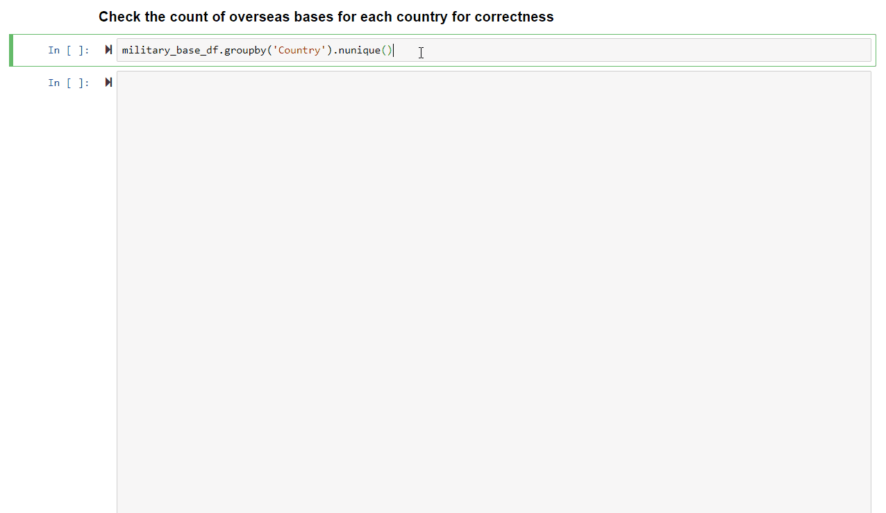
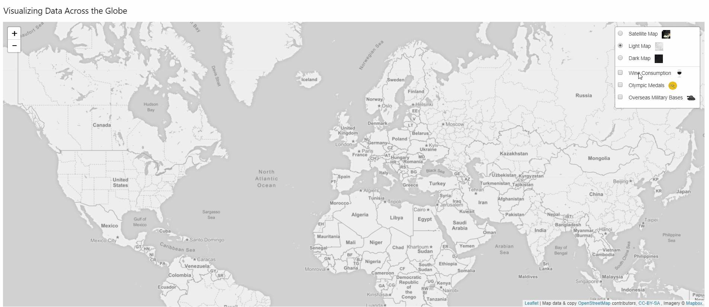
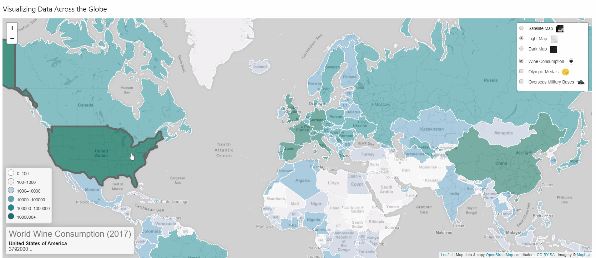
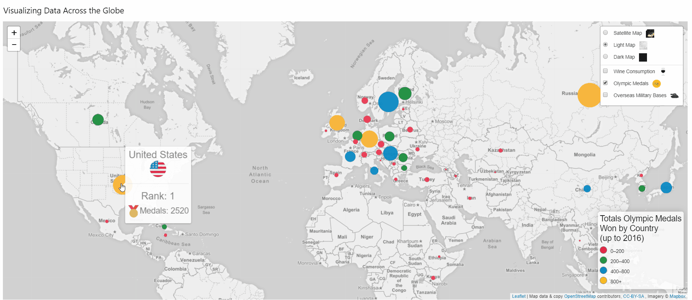

# Visualizing Data Across the Globe
<p align='center'></p><br>

## Contributors:
* Julia Gajda
* Kathleen Graham
* Tamara Najjar

<br>

## Overview:
Our project was originally inspired by this shortened clip from an episode of [the Newsroom](https://www.youtube.com/watch?v=16K6m3Ua2nw&t=125s). At minute 1:05, the character gives a lot of statistics about the United States compared to the rest of the world.
We wanted a visualization that had three layers on one map that also contained 3 views: light, dark, and satellite. We set out to plot a few popular trends but had trouble getting data, so our final layers included data on wine consumption in Liters, total number of Olympic medals won, and number of overseas military bases. The U.S. is leading in all three of these. Our steps were as follows: 

<br>

## STEP 1: Finding Data

FIND THE DATA! This is never as easy as it sounds. We were able to find a PDF containing wine consumption data and a few different sites on Olympic medal and international military bases data that we could scrape. Throughout the course of this project, we came across more and more helpful resources. Each resource will be referenced at the appropriate step.

<br>

## STEP 2: Cleaning Data After Extracting PDFs and Web Scraping

<br>

#### Extracting Data on Wine Consumption from PDF

We were able to find a PDF containing wine consumption data for 205-2017 from the [Wine Institute](https://www.wineinstitute.org/files/World_Consumption_by_Country_2017.pdf). However, we needed to find a way to convert that data from a PDF into a CSV so we could use it in our code. We used [PDF Element](https://pdf.wondershare.com/how-to/extract-data-from-pdf-form.html) to do just that. The extraction did most of the heavy lifting so there wasn't quite as much cleaning to do in the CSV after that.

<br>

#### Web Scraping Data on Total Olympic Medals Won by Country

We originally wanted to plot all the Billionaires around the world but ran into some difficulties. Both Forbes and Bloomberg had lists that were nearly impossible to scrape. There was no visible body in the HTML. It was linked to a private directory that we could not access, so we resorted to a different topic - Olympic Medals Won by Country.
    
We were able to scrape the [Olympic medal data](https://www.worldatlas.com/articles/countries-with-the-most-olympic-medals.html). Converting to a CSV directly from Jupyter Notebook was not working properly so we exported to an xlsx file and saved as a CSV.

<br>

```python
import requests
import pandas as pd
from splinter import Browser
from bs4 import BeautifulSoup as bs

executable_path = {'executable_path': '/Users/tamaranajjar/Documents/BOOTCAMP/NUCHI201905DATA2/12-Web-Scraping-and-Document-Databases/Homework/chromedriver'}
browser = Browser('chrome', **executable_path, headless=False)

url = 'https://www.worldatlas.com/articles/countries-with-the-most-olympic-medals.html'

table = pd.read_html(url)
table[0]

writer = pd.ExcelWriter('olympics.xlsx', engine='xlsxwriter')
df.to_excel(writer, sheet_name='List')
writer.save()
```

<br>

#### Web Scraping Data on International Military Bases by Country

We were able to scrape [International Military Bases by Country](https://en.wikipedia.org/wiki/List_of_countries_with_overseas_military_bases) data from Wikipedia. This was the most difficult site to scrape because Wikipedia has multiple contributors that can alter the HTML. When inspecting the HTML, we found that not all the countries/bases were in the same div or unordered list so it was difficult to iterate through and return the desired results. We found a suitable workaround but it took quite some time.

We set up our [military bases Jupyter notebook file](data/military_bases.ipynb).

<br>

```python
import requests
import pandas as pd
from splinter import Browser
from bs4 import BeautifulSoup as bs
executable_path = {'executable_path': '../chromedriver.exe'}
browser = Browser('chrome', **executable_path, headless=False)
```

<br>

We accessed the url and parsed through the HTML with [Beautiful Soup](https://www.crummy.com/software/BeautifulSoup/bs4/doc/#). We found a common element, a span containing the flag images, between the elements we wanted. Then we attempted to work our way back with ```.parent``` to get the names of the countries that had overseas bases, deleting the last parent element with ```.pop()``` because it was not actually one of the countries.

<br>


<br>

Then with ```.find_next('a')```, we were able to scrape the names of the countries where the overseas bases are located. There were some special cases, such as with the unordered list on Turkey's overseas bases, that had lists of lists, so we had to clean up the data by appending and inserting base name where appropriate.

<br>



<br>

We turned these two lists into a dataframe with pandas.

<br>



<br>

We inspected the count of overseas bases for each country to check for correctness.

<br>



<br>

Last in scraping for overseas bases, we saved to a CSV file. Not every base had a name or any other details, so more information about each military base would have to be added manually if we wanted correct data that had special cases.

<br>

```python
military_base_df.to_csv('military_bases.csv')
```

<br>

## STEP 3: Converting to Geojson

We discovered that local geojson files don't always work the same as geojson files accessed through a link to the file on the web. Through the [Leaflet Choropleth tutorial](https://leafletjs.com/examples/choropleth/), we were able to figure out how to add to our HTML a script with a variable of the [geojson data for the outlines of all the countries in the world](https://raw.githubusercontent.com/tetrahedra/worldmap/master/countries.geo.json). We then used that variable to create our geojson layer of our [logic.js](js/logic.js) file.

This turned out to give us a lot more control over what was put on our map in three different layers. When we wanted to add more data to the geojson file, we were able to manipulate it using a website called [geojson.io](geojson.io). We added references to the appropriate [latitude and longitude](https://developers.google.com/public-data/docs/canonical/countries_csv), names of bases, and even images of little flag icons that could display in a popup or tooltip. We even [converted to geojson from CSV](https://www.onlinejsonconvert.com/csv-geojson.php).


## STEP 4: Visualizing with Leaflet.js

[Leaflet.js](https://leafletjs.com/index.html) has become one of our favorite visualization tools. The interactivity is really fun, especially when you get it to work as you envisioned. Reading through [Leaflet's documentation](https://leafletjs.com/reference-1.5.0.html) helped us come up with some even better ways of visualizing multiple layers at once.

First, we created the base layers through the Mapbox API and included images in the name by adding HTML image tags. The three views we chose were ```mapbox.satellite```, ```mapbox.light```, and ```mapbox.dark```. These layers were added to a layer group variable called ```baseMaps``` and weren't implemented until after all the map overlays were ready to be added to the map.


```javascript
// link to maps with api in config.js
const mapboxLink = 'https://api.tiles.mapbox.com/v4/{id}/{z}/{x}/{y}.png?access_token={accessToken}';

// create satellite map layer
const satmap = L.tileLayer(mapboxLink,{
    attribution: attribution,
    maxZoom: 18,
    id: 'mapbox.satellite',
    accessToken: API_KEY
    });

// create light map layer
const lightmap = L.tileLayer(mapboxLink,{
    attribution: attribution,
    maxZoom: 18,
    id: 'mapbox.light',
    accessToken: API_KEY
});

// create dark map layer
const darkmap = L.tileLayer(mapboxLink,{
    attribution: attribution,
    maxZoom: 18,
    id: 'mapbox.dark',
    accessToken: API_KEY
});

// create basemap layer with the other maps
const baseMaps = {
    "<span>&nbsp;&nbsp; Satellite Map &nbsp;&nbsp;</span>": satmap,
    "<span>&nbsp;&nbsp; Light Map &nbsp;&nbsp;</span>": lightmap,
    "<span>&nbsp;&nbsp; Dark Map &nbsp;&nbsp;</span>": darkmap
};
```

<br>


<br>

Later, we came back to this point in our logic.js file and added variables for our layers before any functions because we kept getting errors in the console about layers not being defined yet. This was the best place to create them all at once.

<br>

```javascript
// make variables for mapOverlay layers to adjust later
var wineLayer, olympicsLayer, militaryLayer;
```

<br>

Then we created a choropleth layer with Wine Consumption by Country. The first function we made was the ```countryColor()``` function that included a [5-sequence color scheme by Colorbrewer](http://colorbrewer2.org/?type=sequential&scheme=PuBuGn&n=5). This took a little while to get right, but we finally decided on just 5 colors and divided them up from 10<sup vertical-align='super'>2</sup> to 10<sup vertical-align='super'>6</sup>.
<br>

```javascript
// set countryColor based on consumption of wine
function countryColor(d) {
    return d > 1000000 ? '#016c59' :
        d > 100000 ? '#1c9099' :
        d > 10000 ? '#67a9cf' :
        d > 1000 ? '#bdc9e1' :
        d > 100 ? '#f6eff7' :
        'white';
}
```

<br>

We used the ```countryColor()``` function in the following function for the styling of the features in the ```style(feature)``` function.

```javascript

// fxn for filling in the countries
function style(feature) {
    return {
        weight: 2,
        opacity: 1,
        color: 'white',
        dashArray: '3',
        fillOpacity: 0.5,
        fillColor: countryColor(feature.properties.wineConsumption)
    };
}

// fxn for highlighting outline of country on hover
function highlightFeature(e) {
    let layer = e.target;

    layer.setStyle({
        weight: 5,
        color: '#666',
        dashArray: '',
        fillOpacity: 0.7
    });

    // don't want to bring to front because it covers up the olympic circles when both layers checked
    // if (!L.Browser.ie && !L.Browser.opera && !L.Browser.edge) {
    //     layer.bringToFront();
    // }

    info.update(layer.feature.properties);
}

// fxn to reset the outline of countries when not hovering anymore
function resetHighlight(e) {
    wineLayer.resetStyle(e.target);
    info.update();
}

// fxn to zoom in to each country once clicked
function zoomToFeature(e) {
    myMap.fitBounds(e.target.getBounds());
}

// fxn to bring all previous feature fxns together
function onEachFeature(feature, layer) {
    layer.on({
        mouseover: highlightFeature,
        mouseout: resetHighlight,
        click: zoomToFeature
    });
}

// create wine layer that includes styling on three features:
// highlight and resethighlight when hovering, and click to zoom
wineLayer = L.geoJson(wineData, {
    style: style,
    onEachFeature: onEachFeature
});
```



<br>

We used an info section for wine consumption that updates when hovering over different countries:



<br>

We implemented a click-to-zoom feature of the wine layer:


<br>

We added a tooltip with flag icons, country, medal count, and rank for the olympic layer:



<br>

And we also added popups with more information for each little tank in the military layer:

 

<br>

More from the logic.js file:

<br>

```javascript
//////////////////////////////////////////// OLYMPIC MEDALS LAYER ///////////////////////////////////////////
// create markerSize based on number of medals won
function olympicsSize(m) {
    return m > 1000 ? m*150 :
        m > 500 ? m*250 :
        m > 100 ? m*500 :
        m*1000
}

function olympicsColor(d) {
    return d > 800 ? '#FBB32E' :
        d > 400 ? '#0186C3' :
        d > 200 ? '#158C39' :
        '#EE304D'
}

// create olympic layer
olympicsLayer = L.geoJson(olympicsData,{
    pointToLayer:function(feature,latlng){
        return new L.circle(latlng,
            {radius:olympicsSize(feature.properties.medals),fillColor:olympicsColor(feature.properties.medals),fillOpacity:0.9,stroke:false})
            .bindTooltip('<div><h4>'+feature.properties.country+'<br><hr>Rank: '+feature.properties.rank+'</h4><h5>'
            +'Medals: '+feature.properties.medals+'</h5></div>',{'className': 'medal-tooltip'})
            .openTooltip()
    }
})

/////////////////////////////////////// OVERSEAS MILITARY BASES LAYER //////////////////////////////////////
// define tank icon to be used for markers in military layer
const tankIcon = L.icon({
	iconUrl: '../images/tank.svg',
	iconSize: [38, 95]
});

// can look up difference betweeen L.SVG L.marker with icon as a parameter
militaryLayer = L.geoJson(militaryData, {
	pointToLayer: function (feature, latlng) {
        return L.marker(latlng, {icon: tankIcon})
            .bindPopup('<h5>'+feature.properties.country+'</h5>'+feature.properties.base_name, {'className': 'tank-popup'});
	}
});

//////////////////////////////////////////////// GENERAL MAP ///////////////////////////////////////////////
// create overlays
const mapOverlay = {
    "<span>&nbsp;&nbsp; Wine Consumption &nbsp;&nbsp;</span>": wineLayer,
    "<span>&nbsp;&nbsp; Olympic Medals &nbsp;&nbsp;</span>": olympicsLayer,
    "<span>&nbsp;&nbsp; Overseas Military Bases &nbsp;&nbsp;</span>": militaryLayer
};

// load satmap and outline as default
const myMap = L.map('map', {
    center: [45,0],
    zoom: 3,
    layers: [lightmap, wineLayer]
});

// add all map layers
const layerDiv = L.control.layers(baseMaps, mapOverlay, {
    collapsed: false
})

layerDiv.addTo(myMap);

//////////////////////////////////////////// WINE INFO AND LEGEND //////////////////////////////////////////
// control that shows country info on hover
let info = L.control({ position: 'bottomleft' });

// add info div to wine layer
info.onAdd = function() {
    this._div = L.DomUtil.create('div', 'info');
    this.update();
    return this._div;
};

// update info div whenever hovering over a country
info.update = function(props) {
    this._div.innerHTML = '<h4>World Wine Consumption (2017)</h4>' +  (props ?
        '<b>' + props.name + '</b><br />' + props.wineConsumption + ' L'
        : 'Hover over a country<br><br>');
};

// add info div to myMap for wine layer
info.addTo(myMap);

// create wine legend
const legend = L.control({position: 'bottomleft'});

// add function to legend for wine layer
legend.onAdd = function() {
    const div = L.DomUtil.create('div', 'legend');
    const consumption = [0, 100, 1000, 10000, 100000, 1000000]
    // const labels = []
    for (let i = 0; i < consumption.length; i++){
        div.innerHTML +=
            '<i style="background:' + countryColor(consumption[i] + 1) + '"></i> ' +
            consumption[i] + (consumption[i + 1] ? '&ndash;' + consumption[i + 1] + '<br>' : '+')
    }
    return div
}

legend.addTo(myMap);

//////////////////////////////////////////// OLYMPICS INFO AND LEGEND //////////////////////////////////////////
// create olympic legend
const olympicsLegend = L.control({position: 'bottomright'});

// add function to legend for olympics layer
olympicsLegend.onAdd = function() {
    const div = L.DomUtil.create('div', 'oLegend');
    const medals = [0,200,400,800]
    // const labels = []
    div.innerHTML = '<h5>Totals Olympic Medals<br>Won by Country<br>(up to 2016)</h5>'
    for (let i = 0; i < medals.length; i++){
        div.innerHTML +=
            '<i style="background:' + olympicsColor(medals[i] + 1) + '"></i> ' +
            medals[i] + (medals[i + 1] ? '&ndash;' + medals[i + 1] + '<br>' : '+')
    }
    return div
}

/////////////////////////////////////// CONTROL DOMUTILS FOR CERTAIN LAYERS  ////////////////////////////////////
// https://gis.stackexchange.com/a/188341
// show info and legend depending on which layer is checked
myMap.on('overlayadd', function(eventLayer){
    if (eventLayer.name === "<span>&nbsp;&nbsp; Wine Consumption &nbsp;&nbsp;</span>"){
        myMap.addControl(info);
        myMap.addControl(legend);
    } else if (eventLayer.name === "<span>&nbsp;&nbsp; Olympic Medals &nbsp;&nbsp;</span>") {
        myMap.addControl(olympicsLegend);
    }
});

// remove info and legend depending on which layer is unchecked
myMap.on('overlayremove', function(eventLayer){
    if (eventLayer.name === "<span>&nbsp;&nbsp; Wine Consumption &nbsp;&nbsp;</span>"){
         myMap.removeControl(info);
         myMap.removeControl(legend);
    } else if (eventLayer.name === "<span>&nbsp;&nbsp; Olympic Medals &nbsp;&nbsp;</span>") {
        myMap.removeControl(olympicsLegend);
    }
});
```

<br>

## NEXT STEPS:

We would love to extend this project in the future to include the following considerations:
* designing three layers so that it's not too much information at once
* adding more controls such as dropdowns that allow more information but not all at once
* plotting more trends that are popular to compare across the globe (with fewer at once)
* changing the toggling of layers to be only two combinations at once (such as radio buttons for wine and olympic layers but a checkbox for military layer)
* adding flag icons instead of circle markers for the olympic layer
* using a database to get real time data on other trends that change more frequently, such as current billionaires around the world 

<br>

## More things to learn:

As with any project, the scope changed and we learned a lot! But we also learned about some things that we didn't have time to research more about given our current deadline. Some things we'd like to have better understanding of are as follows:
* when to use ```let``` and when to use ```const``` (this still just gets a little confusing when looking through other people's code for examples or ideas).
* the difference between ```this._div.innerHTML``` and ```div.innerHTML``` (we are currently assuming that the first refers to the current div created through L.control in Leaflet and the second is a div that was created inside a function by the programmer).
* differences between and pros/cons of D3 and Leaflet for certain types of plotting.

<br>

## Conclusion:

Visualizing data across the globe can look powerful, but it can be difficult to get clean data in the first place and then plotting it all on one map can make the screen very busy. Limiting to three trends was a good idea and could be adjusted for the future to really allow an even cleaner look.
